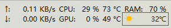
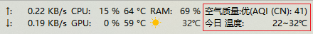
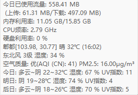
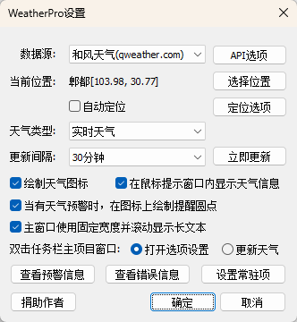
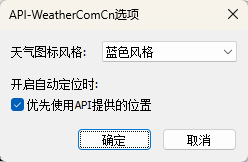
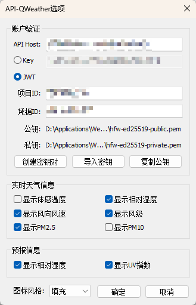
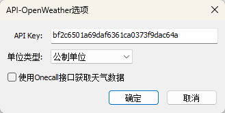
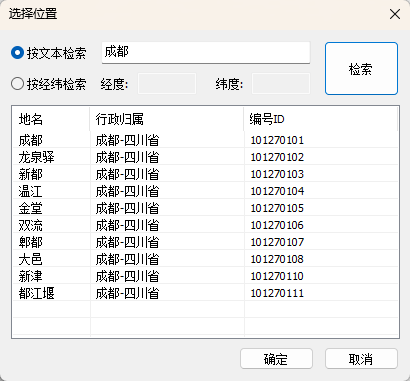
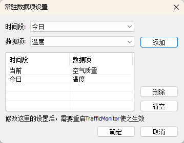
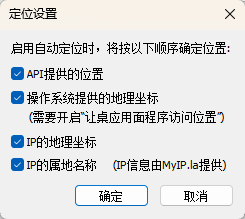

# WeatherPro

WeatherPro 是一款为 [TrafficMonitor](https://github.com/zhongyang219/TrafficMonitor) 开发的天气信息插件，支持多种数据源和丰富的自定义选项。

本项目原始仓库为 [Haojia521/TrafficMonitorPlugins](https://github.com/Haojia521/TrafficMonitorPlugins)，曾发布至 v0.14 版本，现已被归档。当前仓库对代码进行了全面重构与升级，并正式发布 v1.0 版本，后续的新版本也将在此仓库中发布。

## 版本更新 V1.0.4 

建议与TrafficMonitor v1.86及以上版本配合使用

+ [新增] 支持OpenWeather数据源
+ [新增] 按经纬度设置目标位置
+ [新增] 主窗口区滚动显示长文本
+ [新增] 设置常驻数据显示区
+ [新增] 存在天气预警时在图标右上角绘制通知圆点
+ [新增] 新版本发布提醒
+ [优化] 自动定位支持选用API位置、操作系统定位、IP地理坐标和IP属地名称
+ [优化] 在独立窗口中查看详细的预警信息和日志
+ [修复] 查询天气信息时没有正确设置线程语言
+ [修复] 和风天气(QWeather)API在更换密钥后仍返回缓存JWT

## 程序界面介绍

- 任务栏窗口主数据显示区

  显示天气+气温，天气可渲染为图标或文本。新版支持按固定宽度显示，并滚动显示长文本。此处的天气数据可选择当前天气、今日天气、24~48小时天气、48~72小时天气。

  

  V1.0版本支持设置常驻信息显示区，按选定的时间段与数据项目显示数据。修改常驻显示区配置后需要重启TrafficMonitor使配置生效。

  

- 鼠标提示弹窗

  

- 设置界面

  配置数据源、位置和数据显示方式等内容。当有新版本发布时，界面底部将显示“有新版”按钮引导用户下载。

  

- API设置界面

  天气网API-weather.com.cn设置。

  

  和风天气API-qweather.com设置。

  

  OpenWeather API-openweathermap.org设置

  

- 位置设置界面

  除按文本查询位置外，新增支持按经纬度查询位置。经纬度信息在特定接口是必需的，如和风天气(qwather.com)空气质量查询接口和OpenWeather的接口。

  

- 常驻显示区设置

  按照时间段+数据项设置常驻区。常驻区的显示顺序以及标签文本，可在TrafficMonitor的任务栏窗口设置页修改。

  

- 定位设置

  自由选择自动定位的方式。如果所有方式均失败将不改变当前的位置信息。

  

